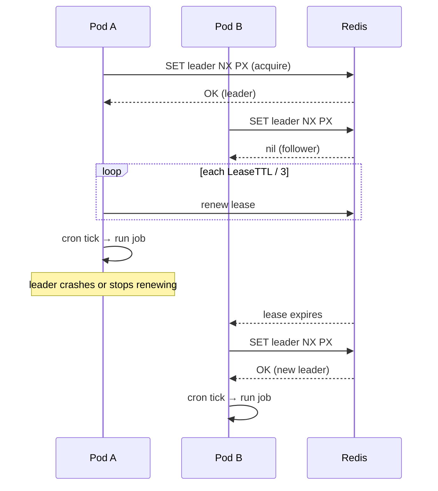

# go-redis-cron

A small Go library for running cron schedules across multiple pods with Redis-backed leader election. Only one instance executes each tick cluster-wide.

## Problem

When you run the same service in multiple replicas, a plain in-process cron scheduler fires on every pod. That duplicates work, wastes resources, and can corrupt shared state.

`go-redis-cron` coordinates replicas through Redis so exactly one pod runs scheduled jobs at a time, with automatic failover when the leader stops renewing its lease.

## Features

- Cron schedules via [robfig/cron](https://github.com/robfig/cron)
- Redis leader election with lease renewal (`SET NX` + TTL heartbeat)
- Safe to call `Start()` on every pod; non-leaders wait quietly
- Graceful shutdown releases the lease for faster failover
- Minimal API surface — scheduler + job registration, no separate worker runtime

## Requirements

- Go 1.22+
- Redis 6+ (standalone, Sentinel, or Cluster with hash-tagged keys)

## Installation

```bash
go get github.com/namtph/go-redis-cron
```

## Quick start

```go
package main

import (
	"context"
	"log"
	"time"

	"github.com/namtph/go-redis-cron"
	"github.com/redis/go-redis/v9"
)

func main() {
	rdb := redis.NewClient(&redis.Options{Addr: "localhost:6379"})

	sched, err := gorediscron.New(rdb, gorediscron.Config{
		Namespace:  "billing",           // isolate keys per deployment
		InstanceID: "billing-pod-abc123", // unique per replica
		LeaseTTL:   10 * time.Second,
	})
	if err != nil {
		log.Fatal(err)
	}

	sched.AddFunc("0 * * * *", func(ctx context.Context) error {
		log.Println("hourly job ran once cluster-wide")
		return nil
	})

	if err := sched.Start(context.Background()); err != nil {
		log.Fatal(err)
	}
	defer sched.Stop(context.Background())
}
```

Run the same binary on every pod. Redis elects one leader; only that pod runs cron callbacks.

## How it works



1. Each pod tries to acquire a namespaced leader key in Redis.
2. The leader renews the lease on an interval shorter than `LeaseTTL`.
3. Only the leader registers and fires cron callbacks.
4. On demotion or shutdown, the pod stops jobs and releases or lets the lease expire.

## Configuration

| Field | Description |
|-------|-------------|
| `Namespace` | Redis key prefix. Use a distinct value per service sharing a Redis DB. |
| `InstanceID` | Unique replica identifier (pod name, hostname, etc.). Must not be reused by live processes. |
| `LeaseTTL` | Leader lease duration. Should be several times the renewal interval. |
| `Logger` | Optional structured logger; defaults to no-op. |

## Guarantees and limits

- **At-most-once per tick** across the cluster under normal operation.
- Jobs should be **idempotent**. Failover during a tick can theoretically overlap with a slow previous run.
- This library schedules and runs callbacks in-process. It is not a distributed task queue.

## Development

```bash
go test ./...
```

Integration tests use [miniredis](https://github.com/alicebob/miniredis) where possible.

## License

MIT
